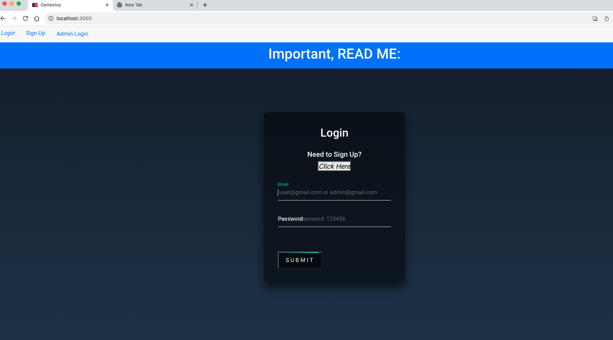
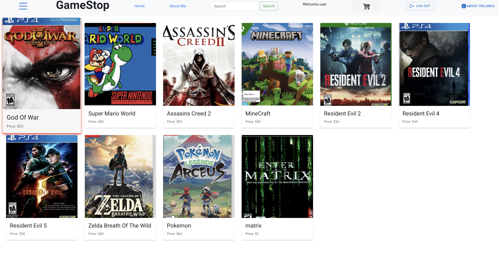

#Recreating Gamestop
Check out the recreated version of Gamestop: [Gamestop Recreated](https://gamestop-byorlando-2ce766547739.herokuapp.com)

### TEST LOGINS

User: user@gmail.com
Password: 123456

Admin: admin@gmail.com
Password: 123456

### Technologies Used

MongoDB, Express.js,React, Node.js, Bootstrap 4, Material UI, CSS/HTML, Javascript

### Welcome Page for Admin

My original gamestop website was recreated and improved!
If You sign up you can choose between been a regular user or admin. As an admin, you will login and redirects you to Create Game Form. Admin has the ability to search, view , edit game informaiton and even Delete!

### Welcome Page for User

If you sign up as a User, you can view games, add to cart(still working on this, with useContext) and search for video games. I added games that are on Clearance, SideBar that contains information about me such as portfolio link, email link etc.

### How is done:

Thanks to Mongoose, i created my Schemas, functions , Full CRUD Functionality
once created, i fetched my data (did not used axios, there was no need for this project as of right now) and stored it my useState.

### Few Screenshot of website

